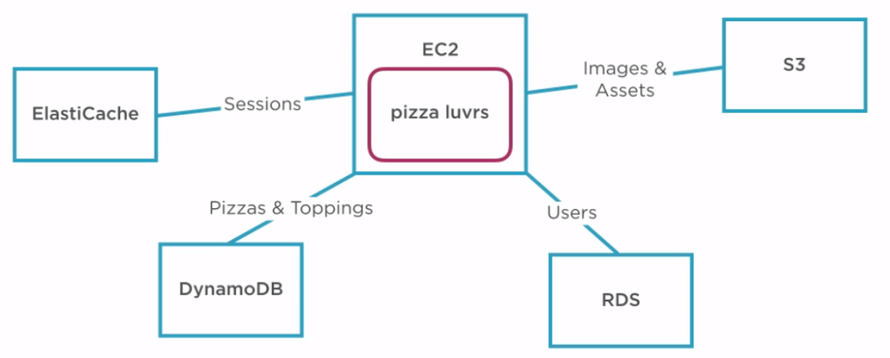
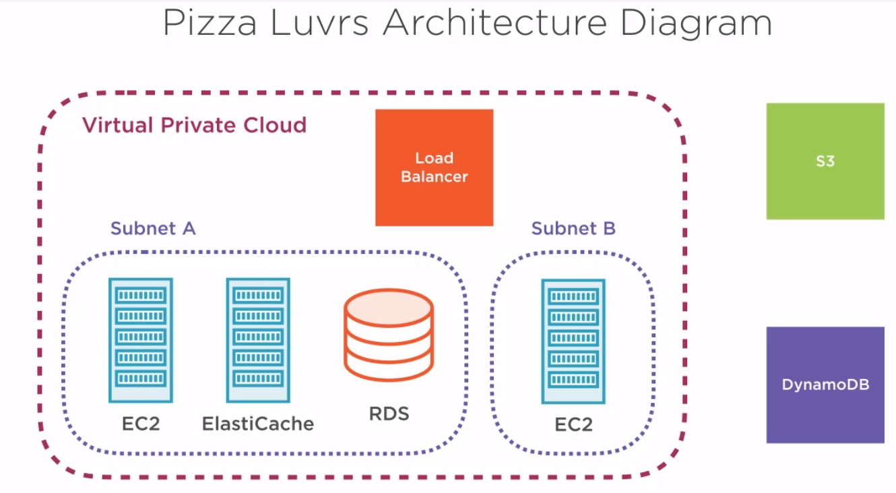
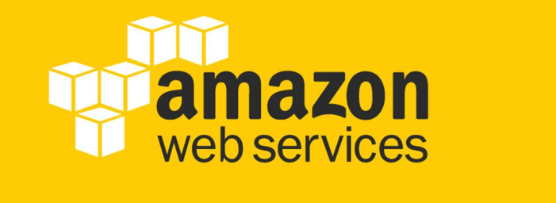
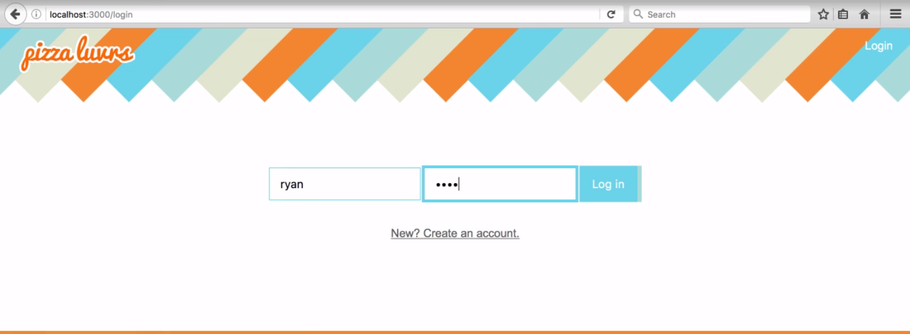
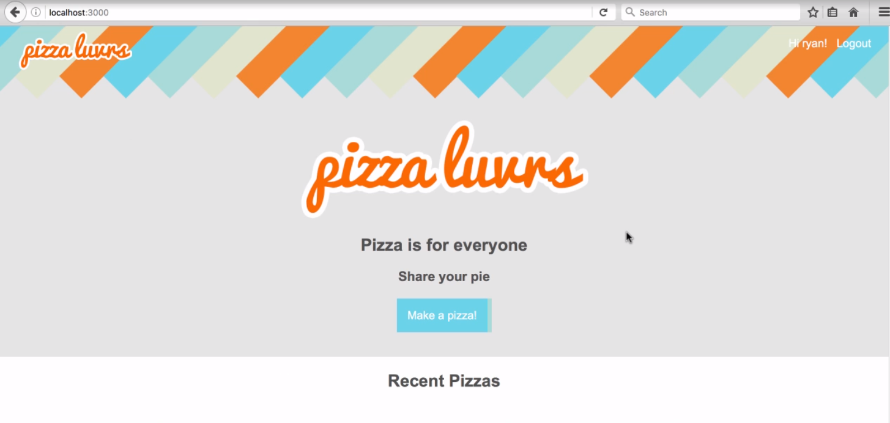
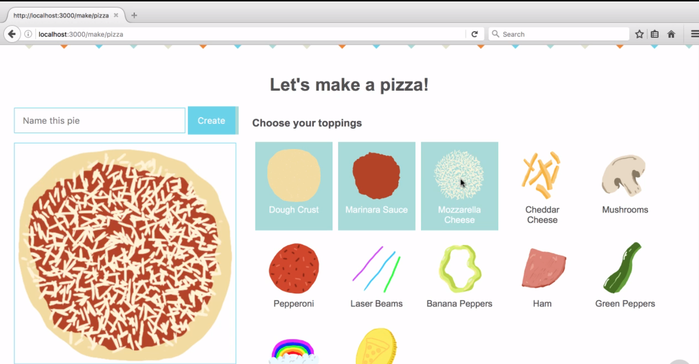
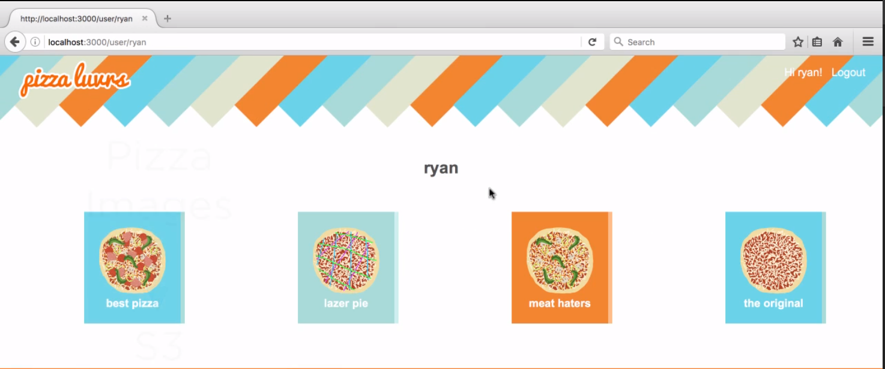
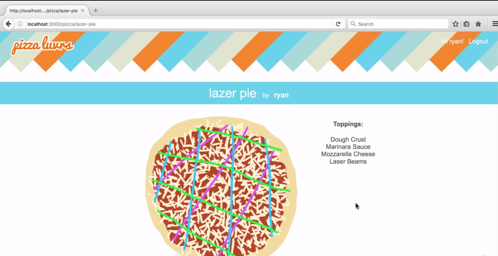

# AWS-MakeAPizza
Making a pizza web application using complete AWS Stack

## Goal
* The goal is to build a scalable web application which uses complete Stack of AWS services like EC2, S3, DynamoDB, RDS, ElastiCache etc. with load balancing and auto-scaling features. 
* This web application enables users to create pizzas using various ingredients and view pizzas created by others.

## System Design





### Technology stack



<table>
<thead>
<tr>
<th>Area</th>
<th>Technology</th>
</tr>
</thead>
<tbody>
	<tr>
		<td>Front-End</td>
		<td>HTML5, CSS3,Bootstrap, Javascript ( ES6 )</td>
	</tr>
  	<tr>
		<td>Back-End</td>
		<td>Node.js, Hapi.js</td>
	</tr>
  </tr>
  	<tr>
		<td>Session Management & Caching</td>
		<td>CloudFront, ElastiCache, Redis Cluster</td>
	</tr>
   </tr>
  	<tr>
		<td>Images & Assets Storage</td>
		<td>AWS S3</td>
	</tr>
  <tr>
		<td>Database</td>
		<td>DynamoDb, RDS</td>
	</tr>
  <tr>
		<td>Deployment</td>
		<td>VPC, EC2, Elastic Beanstalk, CloudFormation</td>
	</tr>
	<tr>
		<td>Scalability</td>
		<td>Load Balancer, Auto Scaling Group</td>
	</tr>
	 <tr>
		<td>Other AWS Services</td>
		<td>IAM, CloudWatch, SNS</td>
	</tr>
</tbody>
</table>

## Screenshots

##### HomePage

##### Login

##### User Dashboard

##### Pizza Dashboard

##### Completed Pizza

##### All Pizzas

##### Pizzas by other users


## Steps for Project Execution :
```
cd AWS-MakeAPizza
npm install
npm start
node index.js
```

